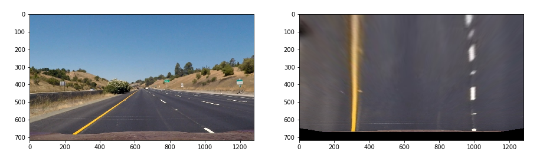
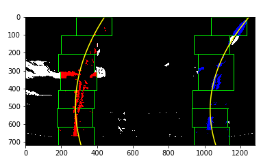
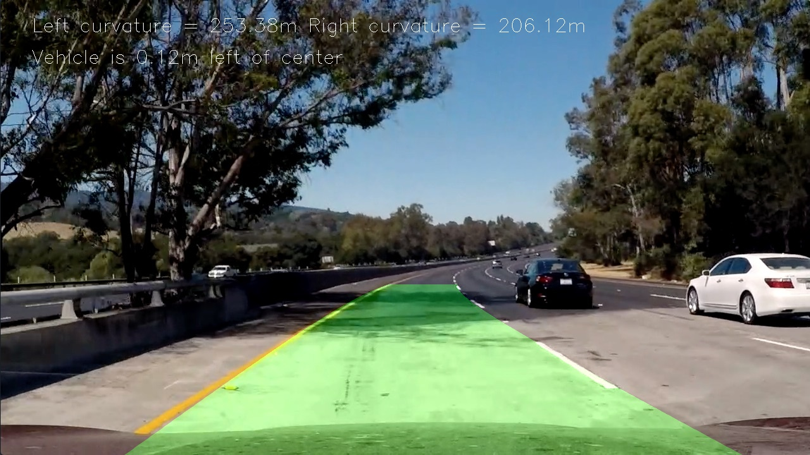

# **Advanced Lane Finding**

## Goals / Steps

* Compute the camera calibration matrix and distortion coefficients given a set of chessboard images.
* Apply a distortion correction to raw images.
* Use color transforms, gradients, etc., to create a thresholded binary image.
* Apply a perspective transfor to refy binary image ("birds-eye view").
* Detect lane pixels and fit to find the lane boundary.
* Determine the curvature of the lane and vehicle position with respect to center.
* Warp the detected lane boundaries back onto the original image.
* Output visual display of the lane boundaries and numerical estimation of lane curvature and vehicle position.

[//]: # (Image References)

[image1]: ./examples/undistort_output.png "Undistorted"
[image2]: ./test_images/test1.jpg "Road Transformed"
[image3]: ./examples/binary_combo_example.jpg "Binary Example"
[image4]: ./examples/warped_straight_lines.jpg "Warp Example"
[image5]: ./examples/color_fit_lines.jpg "Fit Visual"
[image6]: ./examples/example_output.jpg "Output"
[video1]: ./project_video.mp4 "Video"

## Rubric Points

### Here I will consider the [rubric points](https://review.udacity.com/#!/rubrics/571/view) individually and describe how I addressed each point in my implementation.  

---

### Camera Calibration

#### 1. compute the camera matrix and distortion coefficients

The code for this step is contained in the first code cell of the IPython notebook located in "Advanced_lane_finding.ipynb".

I start by preparing "object points", which will be the (x, y, z) coordinates of the chessboard corners in the world. Here I am assuming the chessboard is fixed on the (x, y) plane at z=0, such that the object points are the same for each calibration image. Thus, `objp` is just a replicated array of coordinates, and `objpoints` will be appended with a copy of it every time I successfully detect all chessboard corners in a test image. `imgpoints` will be appended with the (x, y) pixel position of each of the corners in the image plane with each successful chessboard detection.

I then used the output `objpoints` and `imgpoints` to compute the camera calibration and distortion coefficients using the `cv2.calibrateCamera()` function. I applied this distortion correction to the test image using the `cv2.undistort()` function and obtained this result:

### Pipeline (single images)

#### 1. Distortion-corrected image.

To demonstrate this step, I will describe how I apply the distortion correction to one of the test images like this one:

After applying `cv2.undistort()` function, the undistorted image would be like this one:

#### 2. Thresholded binary image

I used a combination of color and gradient thresholds to generate a binary image (thresholding steps at cell "Create a threshold binary image" in `Advanced_lane_finding.ipynb`). Here's an example of my output for this step.

#### 3. Perspective transform

The code for my perspective transform is included in the cell "Perspective transform". I manually selected 4 `src` points, and 4 `dst` point to calculate perspective transform matrix `M` and `Minv`. These are the values of `src` and `dst`:

| Source        | Destination   | 
|:-------------:|:-------------:| 
| 310, 650      | 310, 650      | 
| 1010, 650     | 1010, 650     |
| 595, 450      | 310, 0        |
| 690, 450      | 1010, 0       |

Here is the warped counterpart image of the test image, and the lines appear parallel in the warped image.

#### 4. Identify lane-line pixels and fit their positions with a polynomial

In the 5th cell, I applied the sliding window method to fit the lane-line pixels with a polynomial. The sliding window starts from the bottom of the binary picture, and regards the two peaks as the positions of left and right lanes. Then the sliding window moves upward and find the rest part of the lane lines. Finally the `np.polyfit()` function can fit the pixel position with a 2nd order polynomial. Here is the result of the lane line curve. 

#### 5. Radius of curvature of the lane and the position of the vehicle with respect to center

I did this in the 6th cell of my jupyter notebook. The radii of left and right lines in pixels and meter spaces are calculated separately in my code.

#### 6. Result image plotted back down onto the road

I warped the bird-view image back to the original image in the 7th cell, and inserted the text into the output image in the 8th cell. Here is an example of my result on a test image:

#### 7. Merge step 4 to step 6 together

In the 9th cell I merged step 4 to step 6 together. The `detect_lane()` function takes an original road lane image and outputs the final image labeling the region of road lane.

### Pipeline (video)

#### 1. Video class

In the last cell, I converted the function in step 7 to a `Video` class. The class is initialized with the parameters of camera calibration and perspective transform, as well as the first frame of a video. During the lane finding process, for every 10 frame, the class calls `detect_lane_blind()`, which detects the lane blindly. In other consecutive 9 frames, the Video class calls `detect_lane()`, which detects the lane based on the result of the previos frame. That will save the time of lane detection. 

#### 2. Link to the final video output

Here is a [link to my video result](./output_video.mp4)

### Discussion

#### 1. Problems / issues you faced in your implementation of this project

In the final video, the detection fails in several frames, but that did not hurt too much to the self-driving. To make the performance better, I tried several methods, such as evaluating the direction of gradient by combining x and y sobel, and using the red channel for lane detection. But finally the original method that only uses sobel in x direction and gray scale performed the best, and I adopted this method.

Another problem is the time consumption. The code needs more than 15 minutes to output a 50-second video. Maybe using a better computer or GPU will help to increase the efficiency.