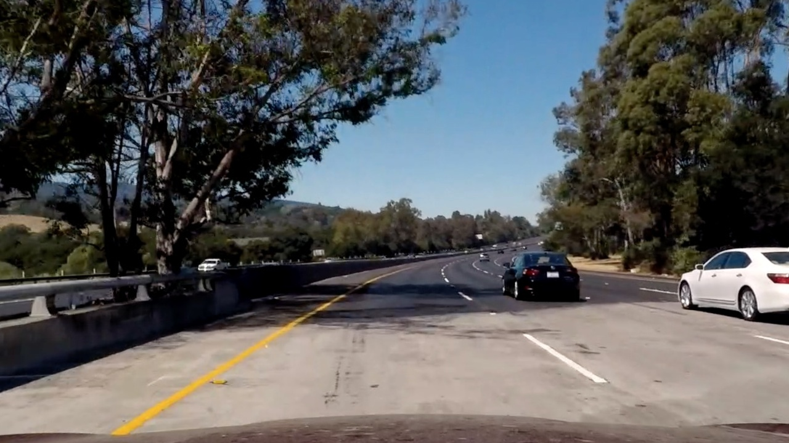
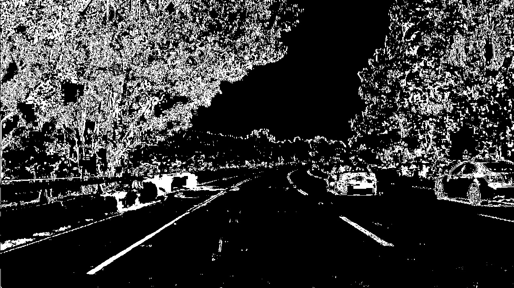

# **Advanced Lane Finding**

## Goals / Steps

* Compute the camera calibration matrix and distortion coefficients given a set of chessboard images.
* Apply a distortion correction to raw images.
* Use color transforms, gradients, etc., to create a thresholded binary image.
* Apply a perspective transfor to refy binary image ("birds-eye view").
* Detect lane pixels and fit to find the lane boundary.
* Determine the curvature of the lane and vehicle position with respect to center.
* Warp the detected lane boundaries back onto the original image.
* Output visual display of the lane boundaries and numerical estimation of lane curvature and vehicle position.

[//]: # (Image References)

[image1]: ./examples/undistort_output.png "Undistorted"
[image2]: ./test_images/test1.jpg "Road Transformed"
[image3]: ./examples/binary_combo_example.jpg "Binary Example"
[image4]: ./examples/warped_straight_lines.jpg "Warp Example"
[image5]: ./examples/color_fit_lines.jpg "Fit Visual"
[image6]: ./examples/example_output.jpg "Output"
[video1]: ./project_video.mp4 "Video"

## Rubric Points

### Here I will consider the [rubric points](https://review.udacity.com/#!/rubrics/571/view) individually and describe how I addressed each point in my implementation.  

---

### Camera Calibration

#### 1. compute the camera matrix and distortion coefficients

The code for this step is contained in the first code cell of the IPython notebook located in "Advanced_lane_finding.ipynb".

I start by preparing "object points", which will be the (x, y, z) coordinates of the chessboard corners in the world. Here I am assuming the chessboard is fixed on the (x, y) plane at z=0, such that the object points are the same for each calibration image. Thus, `objp` is just a replicated array of coordinates, and `objpoints` will be appended with a copy of it every time I successfully detect all chessboard corners in a test image. `imgpoints` will be appended with the (x, y) pixel position of each of the corners in the image plane with each successful chessboard detection.

I then used the output `objpoints` and `imgpoints` to compute the camera calibration and distortion coefficients using the `cv2.calibrateCamera()` function. I applied this distortion correction to the test image using the `cv2.undistort()` function and obtained this result:

![Calibration][./examples/undistort_output.png]

### Pipeline (single images)

#### 1. Distortion-corrected image.

To demonstrate this step, I will describe how I apply the distortion correction to one of the test images like this one:

After applying `cv2.undistort()` function, the undistorted image would be like this one:

#### 2. Thresholded binary image

I used a combination of color and gradient thresholds to generate a binary image (thresholding steps at cell "Create a threshold binary image" in `Advanced_lane_finding.ipynb`). Here's an example of my output for this step.

#### 3. Perspective transform

The code for my perspective transform is included in the cell "Perspective transform". I manually selected 4 `src` points, and 4 `dst` point to calculate perspective transform matrix `M` and `Minv`. These are the values of `src` and `dst`:

| Source        | Destination   | 
|:-------------:|:-------------:| 
| 310, 650      | 310, 650      | 
| 1010, 650     | 1010, 650     |
| 595, 450      | 310, 0        |
| 690, 450      | 1010, 0       |

Here is the warped counterpart image of the test image, and the lines appear parallel in the warped image.

![warp][test_warped.png]

#### 4. Identify lane-line pixels and fit their positions with a polynomial

Then I did some other stuff and fit my lane lines with a 2nd order polynomial kinda like this:

#### 5. Calculate the radius of curvature of the lane and the position of the vehicle with respect to center.

I did this in lines # through # in my code in `my_other_file.py`

#### 6. Provide an example image of your result plotted back down onto the road such that the lane area is identified clearly.

I implemented this step in lines # through # in my code in `yet_another_file.py` in the function `map_lane()`.  Here is an example of my result on a test image:

---

### Pipeline (video)

#### 1. Provide a link to your final video output.  Your pipeline should perform reasonably well on the entire project video (wobbly lines are ok but no catastrophic failures that would cause the car to drive off the road!).

Here's a [link to my video result](./output_video.mp4)

---

### Discussion

#### 1. Briefly discuss any problems / issues you faced in your implementation of this project.  Where will your pipeline likely fail?  What could you do to make it more robust?

Here I'll talk about the approach I took, what techniques I used, what worked and why, where the pipeline might fail and how I might improve it if I were going to pursue this project further.  
