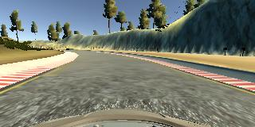
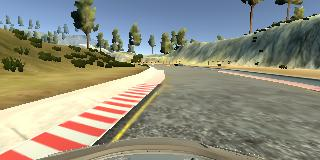
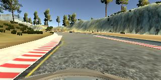
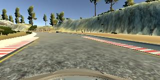
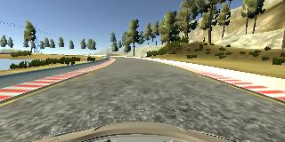
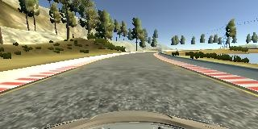

# **Behavioral Cloning** 

## Goals

The goals / steps of this project are the following:
* Use the simulator to collect data of good driving behavior
* Build, a convolution neural network in Keras that predicts steering angles from images
* Train and validate the model with a training and validation set
* Test that the model successfully drives around track one without leaving the road
* Summarize the results with a written report


## Rubric Points

Here I will consider the [rubric points](https://review.udacity.com/#!/rubrics/432/view) individually and describe how I addressed each point in my implementation.  


## Files Submitted & Code Quality

#### 1. All required files that can be used to run the simulator in autonomous mode

My project includes the following files:
* model.py containing the script to create and train the model
* drive.py for driving the car in autonomous mode
* model.h5 containing a trained convolution neural network 
* README.md summarizing the results
* video.mp4 capturing the simulation result

#### 2. Functional code
Using the Udacity provided simulator and my drive.py file, the car can be driven autonomously around the track by executing 
```Sheel
    python drive.py model.h5
```

#### 3. Submission code is usable and readable

The model.py file contains the code for training and saving the convolution neural network. The file shows the pipeline I used for training and validating the model, and it contains comments to explain how the code works.


## Model Architecture and Training Strategy

#### 1. An appropriate model architecture has been employed

My model consists of a convolution neural network with 5x5 filter sizes and depths between 6 and 16 (model.py lines 48-64) 

The model includes RELU layers to introduce nonlinearity (code line 52), and the data is normalized in the model using a Keras lambda layer (code line 50). 

#### 2. Attempts to reduce overfitting in the model

The model contains dropout layers in order to reduce overfitting (model.py lines 61, 63). The model was tested by running it through the simulator and ensuring that the vehicle could stay on the track.

#### 3. Model parameter tuning

The model used an adam optimizer, so the learning rate was not tuned manually (model.py line 66).

#### 4. Appropriate training data

Training data was chosen to keep the vehicle driving on the road. I used a combination of center lane driving, recovering from the left and right sides of the road.

For details about how I created the training data, see the next section. 

### Model Architecture and Training Strategy

#### 1. Solution Design Approach

The overall strategy for deriving a model architecture was to generate the steering angle giving the image captured by car front camera.

My first step was to use a convolution neural network model similar to the AlexNet. I thought this model might be appropriate because it has been proved to be effective in image classification. I increased the filter depths up to 32 at first.

Although the mean squard error was low in traing, the car was easily to run outside the track even on straight lanes. This implied that the model was overfitting. 

To combat the overfitting, I reduced the depths of filters to 16. Then I test the simulation again. The overall performance was acceptable, but there were a few spots where the vehicle fell off the track. To improve the driving behavior in these cases, I collected the samples around those spots by recording the recovering driving process.

At the end of the process, the vehicle is able to drive autonomously around the track without leaving the road. I did not have to manually adjusted the car in the final simulation.

#### 2. Final Model Architecture

The final model architecture (model.py lines 48-64) consisted of a convolution neural network with the following layers and layer sizes.

| Layer         		|     Description	        					| 
|:---------------------:|:---------------------------------------------:| 
| Input					| 160x320x3 rgb image   						| 
| Convolution 5x5		| outputs depth of 6							|
| RELU					|												|
| Max pooling			|												|
| Convolution 5x5	    | outputs depth of 16							|
| RELU					|												|
| Max pooling			|												|
| Convolution 5x5	    | outputs depth of 16							|
| RELU					|												|
| Max pooling			|												|
| Flatten 				|												|
| Dense					| outputs 120									|
| Dropout				| 0.5 keep probability 							|
| Dense					| outputs 84									|
| Dropout				| 0.5 keep probability 							|
| Dense					| outputs 1										|


#### 3. Creation of the Training Set & Training Process

To capture good driving behavior, I first recorded two laps on track one using center lane driving. Here is an example image of center lane driving:



I then recorded the vehicle recovering from the left side and right sides of the road back to center so that the vehicle would learn to recover from left or right. These images show what a recovery looks like starting from the side of a lane:





Then I repeated this process on track two in order to get more data points.

To augment the data sat, I also flipped images and angles thinking that this would simulate the similar condition of the driving conditions. For example, here is an image that has then been flipped:




After the collection process, I had 2292 number of data points.


I finally randomly shuffled the data set and put 20% of the data into a validation set. 

I used this training data for training the model. The validation set helped determine if the model was over or under fitting. The ideal number of epochs was 7 as evidenced by observing the mean loss error during training, because the loss did not reduce obviously after the 7th epoch. I used an adam optimizer so that manually training the learning rate wasn't necessary.
