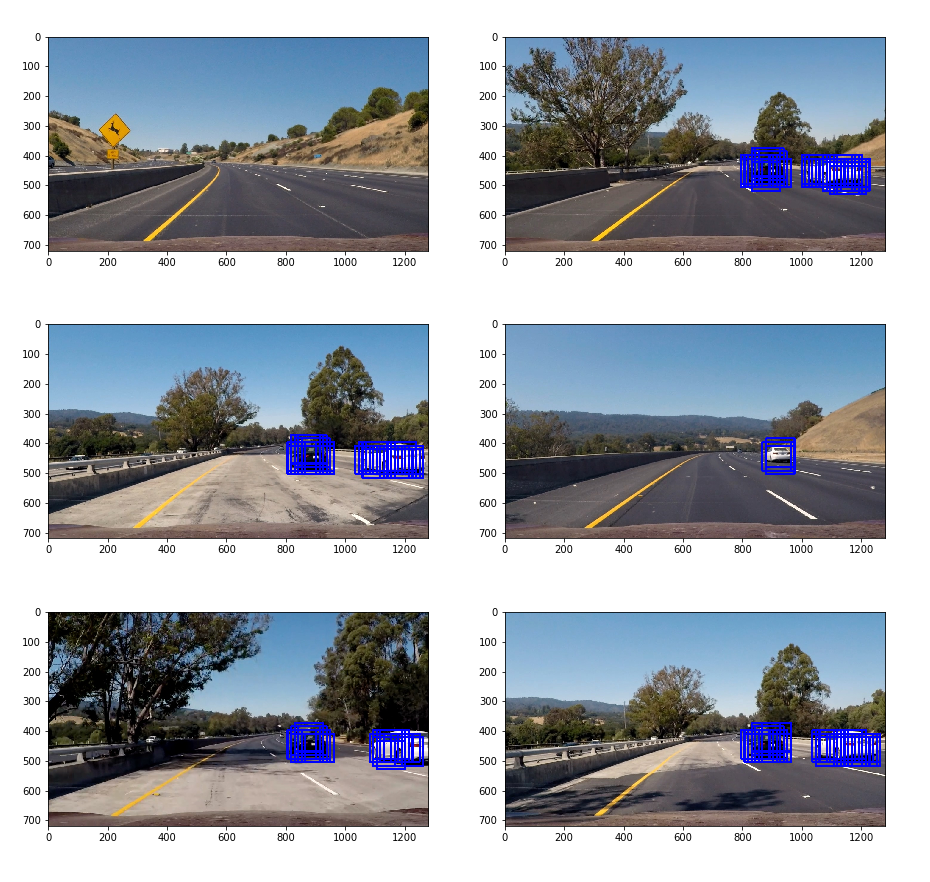

# **Vehicle Detection Project**

## Goals / Steps

* Perform a Histogram of Oriented Gradients (HOG) feature extraction on a labeled training set of images and train a classifier Linear SVM classifier
* Optionally, you can also apply a color transform and append binned color features, as well as histograms of color, to your HOG feature vector. 
* Note: for those first two steps don't forget to normalize your features and randomize a selection for training and testing.
* Implement a sliding-window technique and use your trained classifier to search for vehicles in images.
* Run your pipeline on a video stream (start with the test_video.mp4 and later implement on full project_video.mp4) and create a heat map of recurring detections frame by frame to reject outliers and follow detected vehicles.
* Estimate a bounding box for vehicles detected.

## [Rubric](https://review.udacity.com/#!/rubrics/513/view) Points
### Here I will consider the rubric points individually and describe how I addressed each point in my implementation.  

### Histogram of Oriented Gradients (HOG)

#### 1. Extract HOG features from the training images

The code for this step is contained in the first code cell of the Jupyter notebook.

I started by reading in all the `vehicle` and `non-vehicle` images.  Here is an example of one of each of the `vehicle` and `non-vehicle` classes:

#### 2. HOG features

I then explored different color spaces and different `skimage.hog()` parameters (`orientations`, `pixels_per_cell`, and `cells_per_block`).  I grabbed a image to get a feel for what the `skimage.hog()` output of a car image looks like. Here is an example using the `Gray` color space and HOG parameters of `orientations=8`, `pixels_per_cell=(8, 8)` and `cells_per_block=(2, 2)`:

![hog_demo][examples/hog_demo.png]

#### 3. Color features

Besides HOG features, I also applied the spacial binning feature with 16x16 pixel resolution and histogram color space of feature image as part of my feature vector. The functions `bin_spacial()` and `color_hist()` are in my first code cell.

#### 4. Train a classifier using selected features and choice of HOG parameters

I trained a linear SVM using the HOG features extracted by the previous step. In order to compare performance of differnt HOG parameters, I trained the differnt models by changing `cspace`, `orient` and `pix_per_cell`. Here are the results.

| Color Space         	|     orient	| pix_per_cell | Accuracy      |
|:---------------------:|:-------------:|:------------:|:-------------:| 
| RGB                   |    16         |    16        |     95.78%    |
| YUV                   |    16         |    16        |     97.56%    |
| YUV                   |    8          |    8         |     98.33%    |
| YCrCb                 |    8          |    8         |     99.30%    |

As we can see, when `cspace=YCrCb`, `orient=8`, `pix_per_cell=8`, the accuracy is the highest. So I chose those values as my parameter values in this project.

### Sliding Window Search

#### 1. Implementation of a sliding window search

The function of sliding window search is in my 5th code cell. I decided to search window positions where cars might appear. The boundary pixels of searching window on y-direction is `[350, 656]` in this project. Then the sliding window technique is performed in this range.

#### 2. Examples of test image

Ultimately I set `scale=1.5`, `cells_per_step=1` respectively as my searching scale and step size. Combining the classifier in the previous section, the `find_cars()` function provides a nice result. Here are some example images:

### Multiple Detections & False Positives

#### 1. Heatmap of bounding boxes

To make a heat-map, I added "heat" (+=1) for all pixels within windows where a positive detection is reported by the classifier. A bounding-box image and the corresponding heatmap for an image look like this:

![heatmap][examples/heatmap.png]

#### 2. Lable the heatmap

Then I used the `label()` function from `scipy.ndimage.measurements` to detect multiple cars. The threshold of heatmap that determines a detected car in this project is 3. Here is an example of labeled image and the final result:

![labeled_img][examples/labeled_img.png]

### Video Implementation

#### 1. Link to my final video output

Here's a [link to my video result](./project_output_video.mp4)

#### 2. Image processing pipeline and multiple frames

For each frame in this video. I applied the pipeline of processing a single frame in the previous section. Besides detecting vehicles in a single frames, I also overlapped bounding boxes of 3 most recent frames to avoid noises of a single frame. The final result of the output video seems good.

### Discussion

#### 1. Briefly discuss any problems / issues you faced in the implementation of this project

The pipeline may mistakenly recognize some scene on the road or on the sides of the road as a vehicle. Sometimes the pipeline cannot detect a vehicle further. To make it better, we may segment more parts in the scene that a car cannot apprear. Maybe some classification techniques, like deep learning, will be a classifier to make the pipeline more robust.

